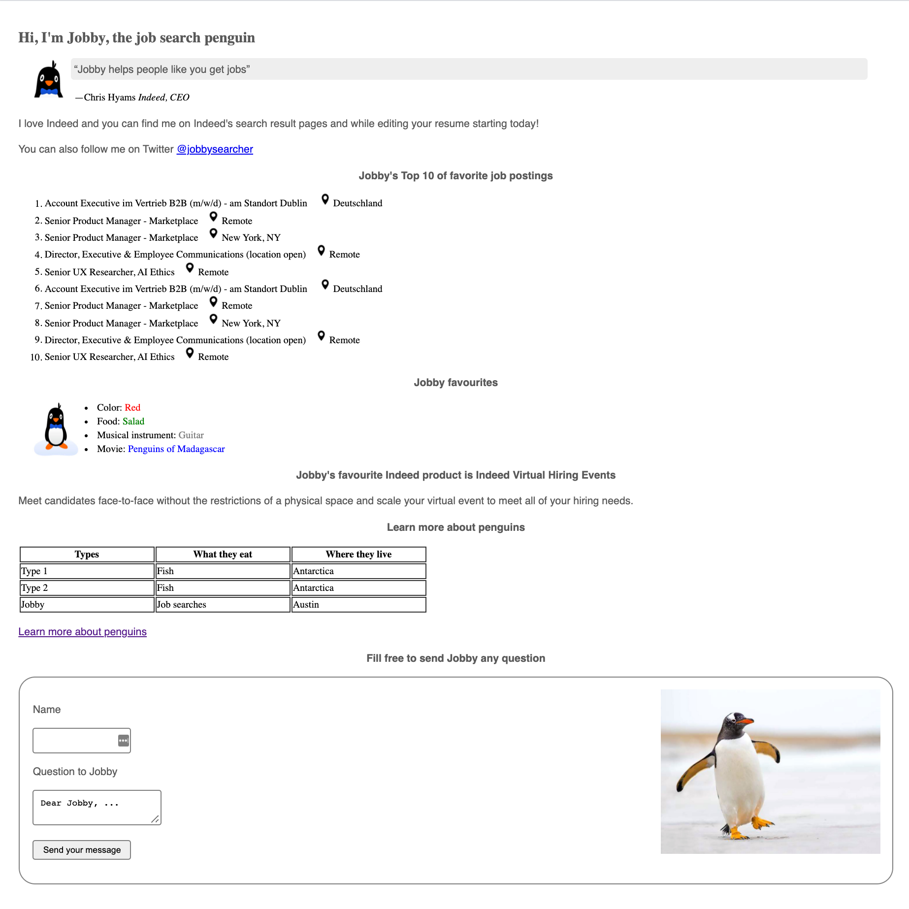

# html-css-assesments

Post Assessment: HTML & CSS

## Setup steps
1.  Fork this project
2.  Create a branch in Git and commit your code in your created branch

### Directions

For your assessment, you will be creating an HTML and CSS file and locators for a new hypothetical web page requested by Indeed’s unofficial mascot, Jobby the penguin. Here are the requirements (you can make up all the data. There’s suggested text below too if you don’t want to make up your own.):


- A header to introduce the page 
    - “Hi, I’m Jobby, the search engine penguin”
- A text paragraph from Jobby about why he likes Indeed
    - “I love Indeed and you can find me on Inndeed’s search result pages and while editing your resume starting today! You can also find me on Twitter @jobbysearcher”
- A ‘Top 10’ list of Jobby’s favorite job postings
- A quote from an Indeedian about Jobby
    - “Jobby helps people like you get jobs.” - Chris Hyams Indeed, CEO
- A table to organize data on types of penguins, what they eat, and where they live (or come up with different categories)
- At least 3 penguin images
- Another paragraph from Jobby that describes one of Indeed’s products 
    - “I like Virtual Hiring Events. You can meet candidates face to face without the restrictions of a physical space.  You can scale your virtual events to meet all of your hiring needs.”
- A bulleted list to go over Jobby’s favorite color, food, musical instrument, and movie
- Links to learn more about penguins
- A form in which a user can fill in their name and a question for Jobby, and submit it with a button (button definitely doesn’t have to work. Just pretend that it does.)

### About your HTML code
* Include the anatomy components of an HTML doc, as discussed in class
* Use 8-11 different HTML elements to get ta 3. See the rubric for how to get a 4 or 5
* Incorporate at least 5 different types of attributes somewhere in the various elements. See the rubric for how to score a 4 or 5
* Include at least 7 of the 10 requirements listed above. See the rubric for how to get a 4 or 5

### About your CSS code
* Include at least one example of a selector from each category of selector we discussed in class (basic, grouping, combinator, pseudo). See the rubric for how to score a 4 or 5.
* Include at least 6-8 different types of CSS properties when styling your page. See the rubric for how to score a 4 or 5

### About your locators
After creating your web page, assume you are going to automate testing for this page and create selenium locators for your page elements. Assume that your Selenium framework works with css selectors and create selectors to the elements on your page. It should be clear which locator is created for which element. 

If you create selenium locator for the following HTML element: 
```
<a id="wikiEmpereurPenguinLink" href="https://upload.wikimedia.org/wikipedia/commons/0/07/Emperor_Penguin_Manchot_empereur.jpg" alt="qawai pienguin">My link to wiki</a>
```
Provide following Selenium CSS selector: 
``` 
// CSS selector for the link with id wikiEmpereurPenguinLink:
CSS: #wikiEmpereurPenguinLink

```
For this assigment part you can use following resouce: https://saucelabs.com/resources/articles/selenium-tips-css-selectors 


The result does not have to look beautiful; rather, we will grade on your ability to use HTML and CSS. However, please implement the required elements above and use a variety of CSS to style them. See the rubric below for how to score a 3 and for how to go for a 4 or 5 if you would like that.
See the example below for what it could look like. Feel free to copy any text or image from it, or create your own content and layout:




